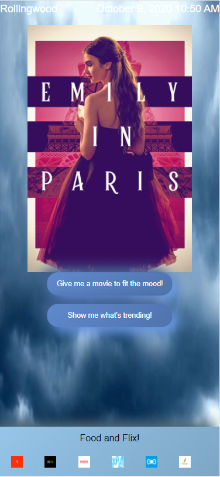

# Meteorology and motion pictures

I remember weather days growing up meant hopefully missing school. Now, bad weather usually means I’m not leaving the house and it’s TV time. Well if you were like me the first 2 weeks of the 2020 lockdown you watched and rewatched everyone of your favorite shows and movies. Now usually when the weather has me in a movie mood I’m scrolling through my streaming services only to find myself rewatching “The Office” for the 1000th time. Well with the help of our Application “Hurri-Cannes”, it does the searching for you. You don’t have to have the bad weather blues to use our app. It takes your local weather and suggests options for you. Whether its raining, snowing, or sunny. We got you. You can also see what movies are trending. Pair our suggestion with your favorite restaurant or snacks and ease your stay at home woes. 

Our app uses the Openweather API and the TMDB API to reccomend movies that will fit your mood depending on how sunny or gloomy the weather is in your area. 

# Deployed app
